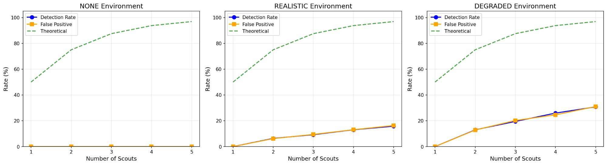

# EEDT-Fortress GitHub アップロード手順

## 📦 準備完了！

EEDT v3 FORTRESSの完全なGitHubリポジトリパッケージが完成しました。

## 📋 含まれるファイル

```
EEDT-Fortress/
├── README.md                     ✅ プロジェクト説明
├── QUICKSTART.md                 ✅ クイックスタートガイド  
├── PROJECT_STRUCTURE.md          ✅ プロジェクト構造
├── LICENSE                       ✅ MIT License
├── requirements.txt              ✅ 依存パッケージ
├── .gitignore                    ✅ Git設定
├── eedt_fortress_json.py         ✅ メインコード
├── docs/
│   └── VALIDATION_REPORT.md      ✅ 詳細レポート
└── results/
    ├── eedt_comparison_*.png     ✅ 比較グラフ
    └── eedt_fortress_results_*.json  ✅ 実験データ
```

## 🚀 GitHubへのアップロード手順

### ステップ1: ファイルをダウンロード

上記の全ファイルをダウンロードして、ローカルの `EEDT-Fortress` フォルダに配置してください。

### ステップ2: GitHubで新しいリポジトリを作成

1. GitHub (https://github.com) にログイン
2. 右上の「+」→「New repository」をクリック
3. リポジトリ設定:
   - **Repository name**: `EEDT-Fortress`
   - **Description**: `Quantum Intrusion Detection using Entanglement-Based Tripwires`
   - **Public** または **Private** を選択
   - ❌ **"Initialize this repository with a README"** はチェックしない
4. 「Create repository」をクリック

### ステップ3: ローカルでGit初期化

ターミナル（Windowsの場合はGit Bash）を開いて:

```bash
# フォルダに移動
cd path/to/EEDT-Fortress

# Git初期化
git init

# ファイルを追加
git add .

# 最初のコミット
git commit -m "Initial commit: EEDT v3 FORTRESS - Quantum Intrusion Detection"

# メインブランチに変更
git branch -M main

# リモートリポジトリを追加（YOUR_USERNAMEを自分のユーザー名に変更）
git remote add origin https://github.com/YOUR_USERNAME/EEDT-Fortress.git

# プッシュ
git push -u origin main
```

### ステップ4: 完了確認

GitHubのリポジトリページ (https://github.com/YOUR_USERNAME/EEDT-Fortress) を開いて確認:
- ✅ README.mdが表示される
- ✅ ファイル構造が正しい
- ✅ 画像が表示される

## 📝 README.mdのカスタマイズ

以下の部分を自分用に編集してください:

### 1. GitHubユーザー名

```markdown
<!-- README.md 内 -->
https://github.com/YOUR_USERNAME/EEDT-Fortress

↓ 変更

https://github.com/093researcher/EEDT-Fortress
```

### 2. 引用情報

```markdown
<!-- README.md 内の Citation セクション -->
@software{eedt_fortress_2026,
  author = {093},
  ...
  url = {https://github.com/YOUR_USERNAME/EEDT-Fortress}
}
```

### 3. 作者情報（任意）

```markdown
<!-- README.md の最後 -->
## 作者

**093** - 独立量子コンピューティング研究者
- Email: your.email@example.com (任意)
- Twitter: @your_handle (任意)
```

## 🎨 リポジトリの見た目を良くする

### トピックを追加

GitHubリポジトリページの「About」セクション（右上）をクリック:
- Topics: `quantum-computing`, `qiskit`, `error-correction`, `entanglement`, `intrusion-detection`

### リポジトリの説明

```
Quantum Intrusion Detection System using Entanglement-Based Tripwires for Adaptive QEC
```

### バッジを追加（オプション）

README.mdの上部に既に以下のバッジがあります:
- ライセンス
- Python バージョン
- Qiskit

## 📊 結果データの扱い

### オプション1: データを含める（推奨）

実験の再現性のため、`results/` フォルダをそのまま含める。

### オプション2: データを除外

`.gitignore` に追加:
```
results/*.json
results/*.png
```

## 🔄 更新方法

新しい実験結果を追加したとき:

```bash
# 変更を確認
git status

# ファイルを追加
git add .

# コミット
git commit -m "Add: new experimental results with T1=50µs"

# プッシュ
git push
```

## 📢 公開後のステップ

### 1. viXra論文をアップデート

```
Updated code repository: https://github.com/YOUR_USERNAME/EEDT-Fortress
```

### 2. LinkedInで共有

```
🚀 EEDT v3 FORTRESS - GitHub公開！

量子エンタングルメントを利用した侵入検知システムの実装を公開しました。

🔗 https://github.com/YOUR_USERNAME/EEDT-Fortress

主な成果:
✅ パリティベース検出の実証
✅ ハードウェア劣化のリアルタイム追跡
✅ 適応的QECの有効性を証明

#QuantumComputing #Qiskit #ErrorCorrection
```

### 3. Qiskit Communityで共有（オプション）

Qiskit Slack (https://qisk.it/join-slack) の #showcase チャンネル

## ✅ チェックリスト

アップロード前に確認:
- [ ] 全ファイルがダウンロードされている
- [ ] YOUR_USERNAMEが自分のユーザー名に変更されている
- [ ] requirements.txtの依存関係が正しい
- [ ] 画像ファイルが含まれている
- [ ] LICENSEファイルがある
- [ ] .gitignoreが適切

## 🆘 トラブルシューティング

### Gitが見つからない

```bash
# Gitをインストール
# Windows: https://git-scm.com/download/win
# Mac: brew install git
# Linux: sudo apt-get install git
```

### プッシュがリジェクトされる

```bash
# 強制プッシュ（初回のみ）
git push -f origin main
```

### 画像が表示されない

README.mdの画像パスを確認:
```markdown

```

## 🎉 完成！

これでEEDT v3 FORTRESSがGitHubで公開されました！

次のステップ:
1. IBM実機での検証を追加
2. コミュニティからのフィードバック
3. 論文への引用情報を更新

---

**質問・問題があれば**: GitHubのIssuesで報告してください！
