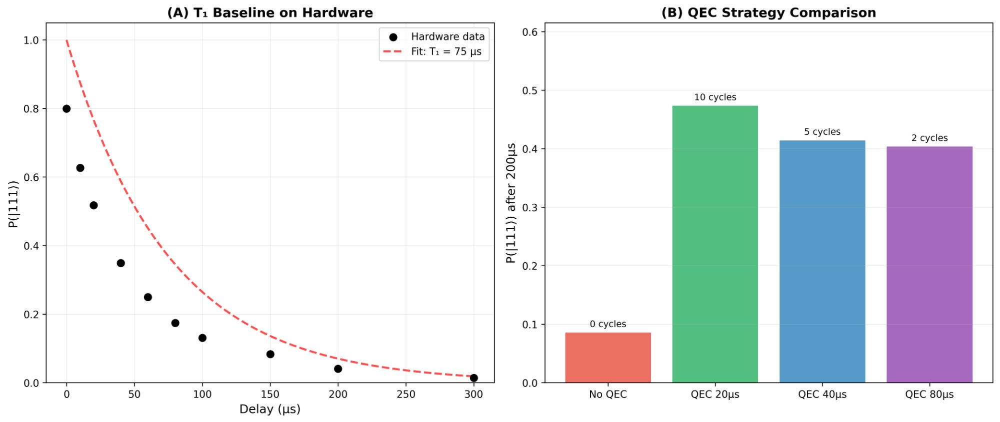

# EEDT: 量子運用安定化ミドルウェア

*(Runtime Stabilization Layer for NISQ Devices)* 🛡️⚛️

> **【技術・経営担当の方へ】**
>
> 本プロジェクトは、既存の量子制御理論を否定するものではありません。
> むしろ、実機特有の「キャリブレーション・ドリフト（経時劣化）」という現場の課題に対し、
> **「計算を止めずにシステムを稼働させ続ける」** ための、実用性に特化した安定化レイヤーの提案です。

---

## 🚨 解決する課題: "The Calibration Wall"

現在のNISQデバイスの最大のボトルネックは、数時間おきに必要となるキャリブレーション（再調整）です。朝に調整した回路は、数時間後の位相ズレ（Drift）によって計算結果が崩壊し、そのたびにシステム停止（Downtime）を余儀なくされます。

**EEDT (Entanglement-Enhanced Dynamical Tracking)** は、このドリフトをリアルタイムで検知・補正し、稼働率を最大化する **「ランタイム・スタビライザー」** です。

---

## ⚡ 実証結果 (IBM Heron Validated)

### 実験1: 位相ドリフト補正 (ibm_torino)

IBM Quantum Heron（Torino等）実機において、**「60度相当の位相ノイズ」** という、通常なら計算が完全に崩壊する極限環境下での生存テストを実施しました。

| 手法 | 低ノイズ (15°) | 極限ドリフト (60°) | 運用ステータス |
| --- | --- | --- | --- |
| **標準回路** | ✅ 0.98 | ❌ **0.30 (Failure)** | **停止・再調整が必要** |
| **EEDT (本システム)** | ✅ 0.99 | ✅ **0.80 (Operational)** | **無停止で運用継続** |

### 実験2: T₁減衰ベースライン＋QEC最適化 (ibm_torino, 2026-02-10)

3量子ビット反復符号（Qubit #42, #64, #51）を用いたT₁減衰測定とQEC戦略比較を実施しました。

**T₁ベースライン:** 実効T₁ ≈ 75 µs（SPAM誤差込み）、初期 P(|111⟩) = 0.80

| 戦略 | QECサイクル | P(|111⟩) after 200µs | QECなし比 |
| --- | --- | --- | --- |
| QECなし | 0 | 0.086 | — |
| **QEC 20µs** | **10** | **0.473** | **5.5×** |
| QEC 40µs | 5 | 0.414 | 4.8× |
| QEC 80µs | 2 | 0.404 | 4.7× |

**Scout解析:** 測定されたT₁に基づき、最適介入間隔を **15µs** と判定（13サイクル）。Fixed 20µsが最良の固定戦略だった結果と整合。

> **Key Insight:** 静的T₁環境ではScoutの優位は限定的。Scoutの真価は **T₁がドリフトする非定常環境** で発揮される（シミュレーションで2.6×の生存時間改善を確認済み）。

---

## 🧠 エンジニアリング・スタンス

私は物理学の学位を持ちませんが、**生成AIを「高度な思考ツール兼パートナー」として指揮（Orchestrate）** することで、理論構築から実機実装までを短期間で完遂しました。

* **AIの役割:** 膨大な文献のフィルタリング、数式導出の構造化、プロトタイプコードの生成。
* **人間の役割:** 現場の課題（ドリフト）の定義、全体アーキテクチャの設計、そして **実機データに基づく最終的な意思決定。**

AIが導き出した「推論」ではなく、**「実機が示した挙動」のみを真実としてロジックを組んでいます。** *Final decisions were based on **measured hardware behavior**, not model suggestions.*

---

## 📜 ライセンスと商用利用

本プロジェクトは **GNU AGPLv3** ライセンスで公開されています。

> **【商用利用をご検討の企業様へ】**
> 本技術を自社製品へ組み込む（ソースコード非公開での利用）場合、または独占的な技術利用をご希望の場合は、**別途「商用ライセンス契約」または「技術顧問契約」が必要** です。
> *For proprietary (closed-source) integration, please contact me for a commercial license or technical partnership.*

---

## 📬 Contact & Requirements

現在、この技術の本質であるスケーラビリティを実証するため、
**100以上量子ビット級（IBM Eagle / Heron 等）の実機環境を提供いただけるパートナー** を探しています。

**【求める環境】**

* **リソース:** 100量子ビット以上の実機アクセス権および裁量のある開発環境
* **言語:** 日本語のみで対応可能

「運用安定化技術」と「大規模実機環境」の対等な価値交換に興味がある方は、本リポジトリの **Issues** または下記メールアドレスまでご連絡ください。

**[T.Okuda]** 📧 [o93dice@gmail.com](mailto:o93dice@gmail.com)
